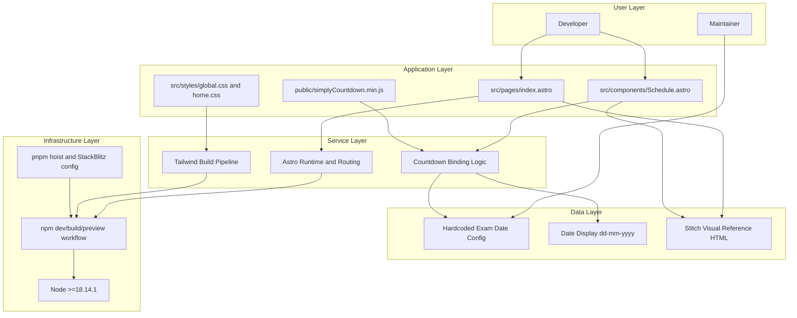

# Epic Architecture Overview

This epic defines the implementation-first technical foundation for the exam tracker app using the latest stable Astro and Tailwind setup. It standardizes scaffold structure, static asset integration, and local run/build behavior before downstream feature work begins.

## System Architecture Diagram

## High-Level Features and Technical Enablers

### Features

- Astro Tailwind Latest Bootstrap

### Technical Enablers

- Dependency and runtime baseline for latest Astro and latest Tailwind.
- Deterministic file layout and command conventions.
- Stable browser-side simplyCountdown integration from public assets.

## Technology Stack

- Astro latest stable release.
- Tailwind latest stable release using official Astro-recommended setup path.
- Client-side countdown initialization through bundled simplyCountdown script.

## Technical Value

High. This architecture is a prerequisite for predictable implementation velocity and low setup risk.

## T-Shirt Size Estimate

S
