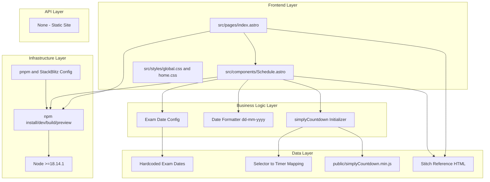

# Goal

Implement a first-priority bootstrap baseline for latest Astro and latest Tailwind, including file structure, commands, environment setup constraints, and countdown integration details. This feature executes before all other implementation work.

## Requirements

- Create project scaffold with latest stable Astro.
- Add latest stable Tailwind using official Astro-recommended setup at implementation time.
- Establish files and structure:
  - src/pages/index.astro
  - src/components/Schedule.astro
  - src/styles/global.css
  - src/styles/home.css
  - public/simplyCountdown.min.js
- Keep Astro component structure convention (frontmatter, markup, style/script blocks).
- Keep date format dd-mm-yyyy for display.
- Keep simplyCountdown bindings synced with date entries.
- Add scripts and runtime details:
  - npm run dev or npm start at localhost:3000
  - npm run build
  - npm run preview
- Set engines Node >=18.14.1.
- Include environment caveats for pnpm hoist and StackBlitz.

## Technical Considerations

### System Architecture Overview



### Database Schema Design

No database. Hardcoded static data only.

### API Design

No API endpoints.

### Frontend Architecture

#### Component Hierarchy Documentation

```text
index.astro
└── Schedule.astro
    ├── Date Banner
    ├── Subject Date List
    └── Countdown Timer Bindings
```

### Security Performance

- Keep client-side script footprint minimal and focused.
- Preserve static-first rendering and avoid unnecessary runtime dependencies.
