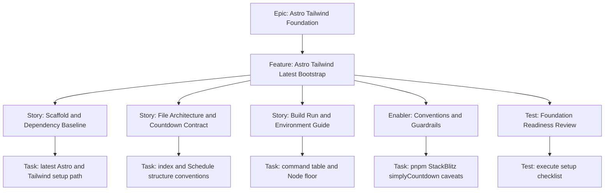

# 1. Project Overview

- Feature Summary: Bootstrap latest Astro and Tailwind foundation with full technical setup details for this static exam-countdown app.
- Success Criteria: Scaffold reproducibility, command clarity, environment compatibility, and preserved countdown integration conventions.
- Key Milestones:
  - Scaffold and dependency baseline defined
  - File architecture and countdown conventions defined
  - Environment constraints and command table defined
  - Foundation readiness reviewed
- Risk Assessment:
  - Risk: version drift or setup mismatch across environments
  - Mitigation: explicit latest-stable policy and implementation-time lock with docs

## 2. Work Item Hierarchy

## 3. GitHub Issues Breakdown

- Story: Scaffold and Dependency Baseline (3 pts)
- Story: File Architecture and Countdown Contract (3 pts)
- Story: Build Run and Environment Guide (2 pts)
- Enabler: Conventions and Guardrails (2 pts)
- Test: Foundation Readiness Review (1 pt)

## 4. Priority and Value Matrix

- Priority: P0
- Value: High
- Labels: `priority-critical`, `value-high`, `foundation`

## 5. Estimation Guidelines

- Total estimate: 11 story points
- Feature size: S

## 6. Dependency Management

- Blocked by: None
- Blocks: All downstream implementation epics
- Prerequisite: This feature executes first

## 7. Sprint Planning Template

## Sprint Goal

Primary Objective: Deliver a complete and reproducible Astro plus Tailwind bootstrap baseline before all other implementation work.

Stories in Sprint:
- Scaffold and Dependency Baseline (3)
- File Architecture and Countdown Contract (3)
- Build Run and Environment Guide (2)
- Conventions and Guardrails (2)
- Foundation Readiness Review (1)

Total Commitment: 11 points

## 8. GitHub Project Board Configuration

- Initial column: Sprint Ready
- Move to In Review only when setup checklist is demonstrably executable.
