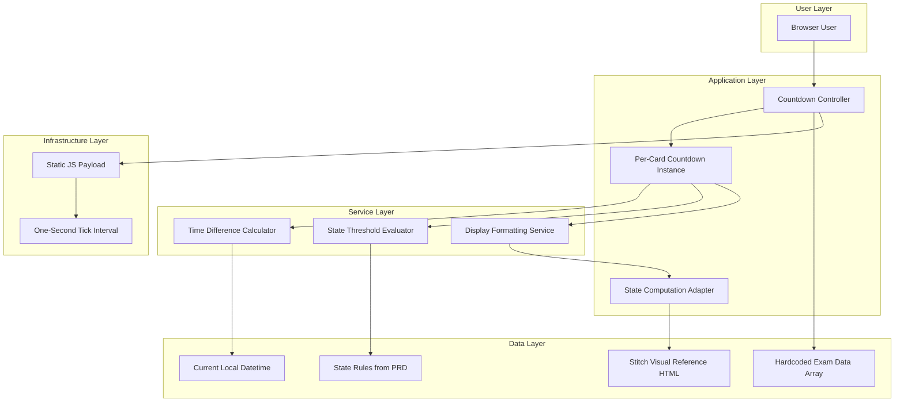

# Epic Architecture Overview

This epic provides deterministic countdown and state transition logic for all exam cards. UI-facing output from this epic must still be validated against stitch/2944944676816621264/668a3253350e441690c92f6971809c95/Exam-Tracker-Deadline-Machine.html wherever countdown output affects visual treatment.

## System Architecture Diagram

## High-Level Features and Technical Enablers

### Features

- Exam Data Contract
- Countdown and State Transition Engine

### Technical Enablers

- Typed exam schema and validation rules.
- Centralized state threshold constants.
- Deterministic formatter for displayed countdown segments.

## Technology Stack

- Client-side JavaScript module for countdown/state.
- Astro page integration entrypoint.
- Tailwind/HTML rendering layer consumer.

## Technical Value

High. Correct logic protects trust in all urgency states and labels.

## T-Shirt Size Estimate

M