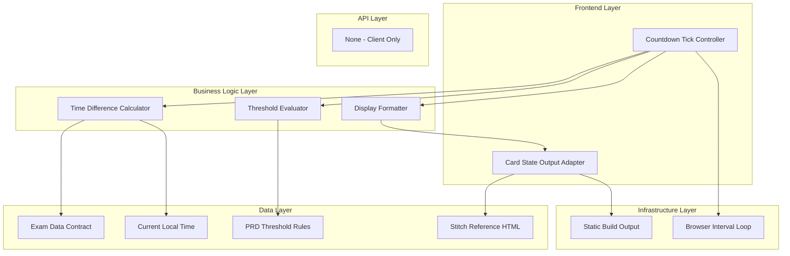

# Goal

Build a deterministic client-side countdown engine that computes display segments and state transitions correctly for every exam card update tick. Whenever logic output drives visible urgency states, verify behavior against stitch/2944944676816621264/668a3253350e441690c92f6971809c95/Exam-Tracker-Deadline-Machine.html.

## Requirements

- Implement per-exam countdown computation routine.
- Implement centralized state evaluator with explicit thresholds.
- Add formatter for segmented timer display.
- Handle day-boundary and same-day edge conditions.
- Expose a clean output contract for rendering layer.

## Technical Considerations

### System Architecture Overview



### Database Schema Design

No database.

### API Design

No API endpoints.

### Frontend Architecture

#### Component Hierarchy Documentation

```text
Countdown Engine
├── Tick Loop
├── State Evaluator
└── Output Adapter (consumed by card renderer)
```

### Security Performance

- Keep interval logic lightweight to avoid frame drops.
- Use deterministic helper functions for testability and low regression risk.
