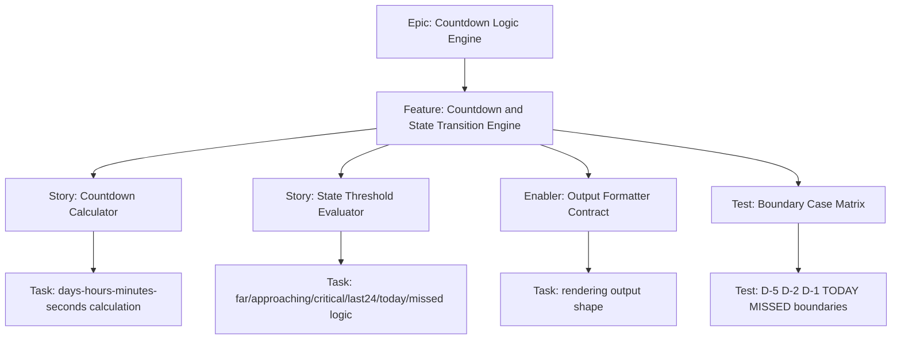

# 1. Project Overview

- Feature Summary: Build countdown timer and threshold-based state transition engine.
- Success Criteria: Correct thresholds, stable per-second updates, deterministic UI state output.
- Key Milestones:
  - Core calculator complete
  - State evaluator complete
  - Edge-case verification complete
- Risk Assessment:
  - Risk: off-by-one threshold errors and local date edge bugs
  - Mitigation: boundary-case test matrix in issues checklist

## 2. Work Item Hierarchy

## 3. GitHub Issues Breakdown

- Story: Countdown Calculator (5 pts)
- Story: State Threshold Evaluator (5 pts)
- Enabler: Output Formatter Contract (3 pts)
- Test: Boundary Case Matrix (3 pts)

## 4. Priority and Value Matrix

- Priority: P0
- Value: High
- Labels: `priority-critical`, `value-high`, `logic`

## 5. Estimation Guidelines

- Total estimate: 16 story points
- Feature size: M

## 6. Dependency Management

- Blocked by: Exam Data Contract
- Blocks: Final visual verification for card states

## 7. Sprint Planning Template

## Sprint Goal

Primary Objective: Deliver deterministic countdown and state transition behavior.

Stories in Sprint:
- Countdown Calculator (5)
- State Threshold Evaluator (5)
- Output Formatter Contract (3)
- Boundary Case Matrix (3)

Total Commitment: 16 points

## 8. GitHub Project Board Configuration

- Move to Testing when boundary matrix includes expected UI-state mapping checks.
