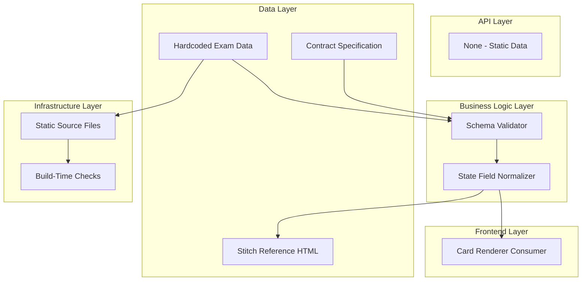

# Goal

Define and enforce a clear hardcoded exam data schema that can be safely edited per cycle and consumed by the countdown/state engine. Where schema values drive UI states, verification should reference stitch/2944944676816621264/668a3253350e441690c92f6971809c95/Exam-Tracker-Deadline-Machine.html.

## Requirements

- Document data shape and accepted value ranges.
- Define lightweight validation procedure for release checks.
- Provide canonical sample records from PRD reference list.
- Align state-related values with rendering expectations.

## Technical Considerations

### System Architecture Overview



### Database Schema Design

No database required.

### API Design

No API endpoints.

### Frontend Architecture

#### Component Hierarchy Documentation

```text
Data Module
└── ExamData Contract
    └── Consumed by Card Rendering and Countdown Logic
```

### Security Performance

- Validation should run in lightweight pre-release checks.
- Keep schema checks deterministic and human-auditable.
