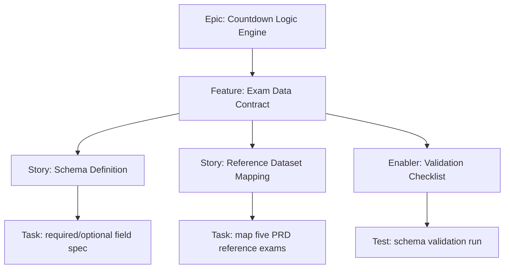

# 1. Project Overview

- Feature Summary: Define and operationalize a stable hardcoded exam data contract.
- Success Criteria: Contract completeness, validation clarity, and low-risk cycle updates.
- Key Milestones:
  - Contract specification draft complete
  - Reference dataset mapped
  - Validation checklist finalized
- Risk Assessment:
  - Risk: invalid fields silently propagate to rendering
  - Mitigation: explicit validation checklist and review gate

## 2. Work Item Hierarchy

## 3. GitHub Issues Breakdown

- Story: Schema Definition (3 pts)
- Story: Reference Dataset Mapping (3 pts)
- Enabler: Validation Checklist (2 pts)
- Test: schema validation run (1 pt)

## 4. Priority and Value Matrix

- Priority: P1
- Value: High
- Labels: `priority-high`, `value-high`, `logic`

## 5. Estimation Guidelines

- Total estimate: 9 story points
- Feature size: S

## 6. Dependency Management

- Blocked by: None
- Blocks: Countdown and State Transition Engine

## 7. Sprint Planning Template

## Sprint Goal

Primary Objective: Publish contract and validation process for cycle-safe data updates.

Stories in Sprint:
- Schema Definition (3)
- Reference Dataset Mapping (3)
- Validation Checklist (2)
- Schema validation run (1)

Total Commitment: 9 points

## 8. GitHub Project Board Configuration

- Move to Done after schema and checklist are reviewed and linked.
