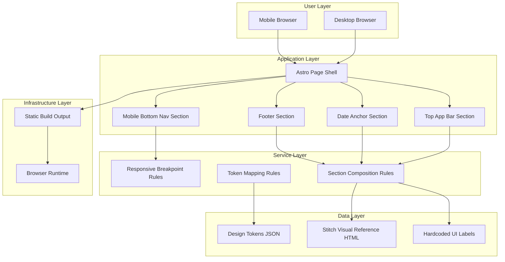

# Epic Architecture Overview

This epic delivers the shell layout foundation for the static Exam Tracker page. The architecture prioritizes deterministic rendering, reusable section composition, and strict visual parity with the Stitch asset at stitch/2944944676816621264/668a3253350e441690c92f6971809c95/Exam-Tracker-Deadline-Machine.html whenever implementing or adjusting UI components.

## System Architecture Diagram

## High-Level Features and Technical Enablers

### Features

- Top Bar and Date Anchor
- Footer and Mobile Navigation

### Technical Enablers

- Shared shell section structure and naming conventions.
- Design-token-driven class mapping and no-soft-style safeguards.
- Responsive spacing contract to avoid fixed-nav overlap.

## Technology Stack

- Astro static page composition.
- Tailwind CSS utility styling and token extension.
- Minimal client-side JavaScript for date display behavior.

## Technical Value

High. A stable shell prevents downstream regressions and enables parallel feature development.

## T-Shirt Size Estimate

M