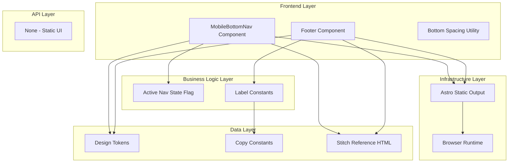

# Goal

Deliver footer and mobile bottom navigation as reusable shell sections that preserve urgency tone, mobile usability, and strict visual parity. All UI implementation and review steps must compare outputs to stitch/2944944676816621264/668a3253350e441690c92f6971809c95/Exam-Tracker-Deadline-Machine.html.

## Requirements

- Implement footer block with thick divider and required copy.
- Implement fixed bottom nav with four item slots.
- Implement active/inactive state classes and hover inversion behavior.
- Add layout-safe bottom padding strategy for card stack.
- Keep component semantics with nav and button/link roles.

## Technical Considerations

### System Architecture Overview



### Database Schema Design

No database changes.

### API Design

No API endpoints.

### Frontend Architecture

#### Component Hierarchy Documentation

```text
Exam Tracker Page
├── Main Content
│   └── FooterBlock (NO_EXCUSES + microcopy)
└── MobileBottomNav (mobile only)
    ├── Grid Nav Item
    ├── Add Nav Item
    ├── Stats Nav Item
    └── Meta Nav Item
```

### Security Performance

- Keep fixed bottom nav lightweight for smooth scroll.
- Ensure no off-screen overflow caused by nav sizing.
