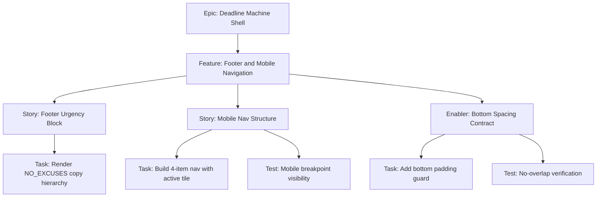

# 1. Project Overview

- Feature Summary: Deliver footer urgency block and fixed mobile bottom navigation.
- Success Criteria: Copy fidelity, fixed-nav visibility behavior, non-overlap at mobile sizes, Stitch parity.
- Key Milestones:
  - Footer structure complete
  - Bottom nav states complete
  - Responsive QA complete
- Risk Assessment:
  - Risk: bottom overlap and clipping on short screens
  - Mitigation: explicit spacing utility and viewport validation set

## 2. Work Item Hierarchy

## 3. GitHub Issues Breakdown

- Story 1: Footer Urgency Block (3 pts)
- Story 2: Mobile Nav Structure (5 pts)
- Enabler 1: Bottom Spacing Contract (2 pts)
- Test: Responsive and overlap QA (2 pts)

## 4. Priority and Value Matrix

- Priority: P1
- Value: High
- Labels: `priority-high`, `value-high`, `frontend`

## 5. Estimation Guidelines

- Total estimate: 12 story points
- Feature size: M

## 6. Dependency Management

- Blocked by: None
- Related: Top Bar and Date Anchor
- Parallel: Urgency state card rendering can proceed after spacing contract is defined

## 7. Sprint Planning Template

## Sprint Goal

Primary Objective: Ship bottom frame with mobile nav behavior and no-overlap guarantees.

Stories in Sprint:
- Footer Urgency Block (3)
- Mobile Nav Structure (5)
- Bottom Spacing Contract (2)
- Responsive and overlap QA (2)

Total Commitment: 12 points

## 8. GitHub Project Board Configuration

- Start in Sprint Ready
- Move to Testing only after screenshot comparison to Stitch reference is attached.
