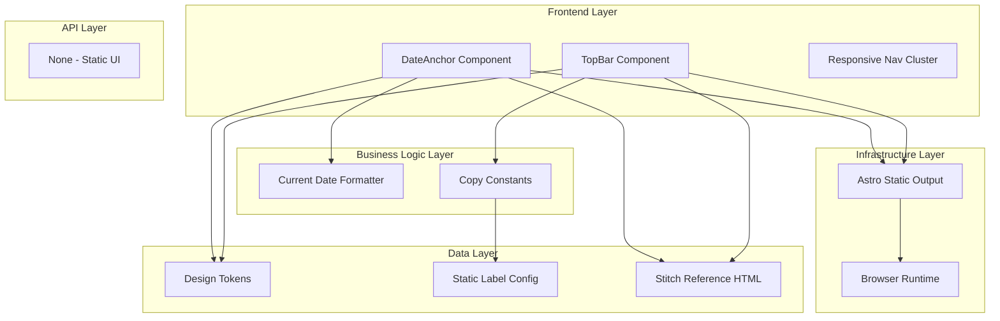

# Goal

Deliver a reusable top shell module for the fixed top app bar and date anchor that is visually consistent with the reference and stable across mobile-first layouts. Implementation should preserve strict design-language constraints while minimizing complexity. All UI implementation decisions must be validated against stitch/2944944676816621264/668a3253350e441690c92f6971809c95/Exam-Tracker-Deadline-Machine.html.

## Requirements

- Build top app bar section with left and right clusters.
- Add responsive behavior to show desktop links only at md+.
- Build date anchor row immediately under top bar.
- Apply hard-border and hard-shadow token classes.
- Ensure top spacing compensation in main content container.
- Keep labels and casing exactly as PRD.

## Technical Considerations

### System Architecture Overview



### Database Schema Design

No database changes. Static page-only feature.

### API Design

No API endpoints required.

### Frontend Architecture

#### Component Hierarchy Documentation

```text
Exam Tracker Page
├── TopAppBar
│   ├── LeftCluster (Terminal Icon + DEADLINE_PROTOCOL)
│   └── RightCluster (Desktop Nav + History Toggle)
└── DateAnchorRow
    ├── SystemStatusBlock
    └── CurrentDateBlock
```

### Security Performance

- Avoid expensive runtime layout calculations.
- Keep fixed header lightweight to reduce scroll jank.
