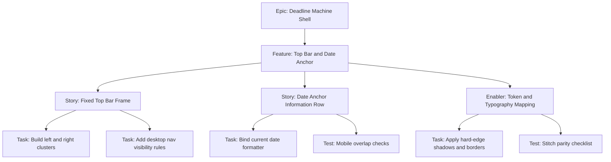

# 1. Project Overview

- Feature Summary: Implement fixed top bar and date anchor with strict visual parity and responsive behavior.
- Success Criteria: Correct labels, no overlap defects, parity against Stitch reference, tokenized styling only.
- Key Milestones:
  - Shell section structure complete
  - Responsive behavior complete
  - Visual parity QA complete
- Risk Assessment:
  - Risk: spacing regressions with fixed bar
  - Mitigation: viewport checklist and early visual verification

## 2. Work Item Hierarchy

## 3. GitHub Issues Breakdown

- Story 1: Fixed Top Bar Frame (5 pts)
- Story 2: Date Anchor Information Row (3 pts)
- Enabler 1: Token and Typography Mapping (2 pts)
- Test: Shell parity and responsive checks (2 pts)

## 4. Priority and Value Matrix

- Priority: P1
- Value: High
- Labels: `priority-high`, `value-high`, `frontend`

## 5. Estimation Guidelines

- Total estimate: 12 story points
- Feature size: M

## 6. Dependency Management

- Blocked by: None
- Blocks: Active urgency card visual integration
- Prerequisite: Design token mapping available

## 7. Sprint Planning Template

## Sprint Goal

Primary Objective: Deliver top-of-page shell sections with responsive behavior and parity checks.

Stories in Sprint:
- Fixed Top Bar Frame (5)
- Date Anchor Information Row (3)
- Token and Typography Mapping (2)
- Shell QA checks (2)

Total Commitment: 12 points

## 8. GitHub Project Board Configuration

- Initial column: Sprint Ready
- Move to In Review when parity checks against Stitch asset are attached.
