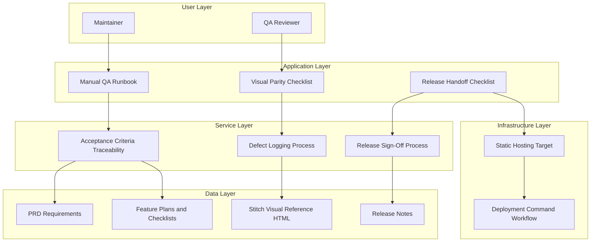

# Epic Architecture Overview

This epic defines lightweight quality and release architecture for static exam-cycle deployments. All UI verification stages in this epic must explicitly compare outputs to stitch/2944944676816621264/668a3253350e441690c92f6971809c95/Exam-Tracker-Deadline-Machine.html where visual parity is required.

## System Architecture Diagram

## High-Level Features and Technical Enablers

### Features

- Visual Regression and Responsive QA
- Deployment Playbook and Handoff

### Technical Enablers

- Standardized acceptance criteria matrix.
- Repeatable release checklist templates.
- Lightweight evidence capture for parity and functional checks.

## Technology Stack

- Markdown planning and checklist artifacts.
- Existing static build/deploy workflow.

## Technical Value

Medium-High. This epic reduces release risk and improves cycle-to-cycle consistency.

## T-Shirt Size Estimate

S