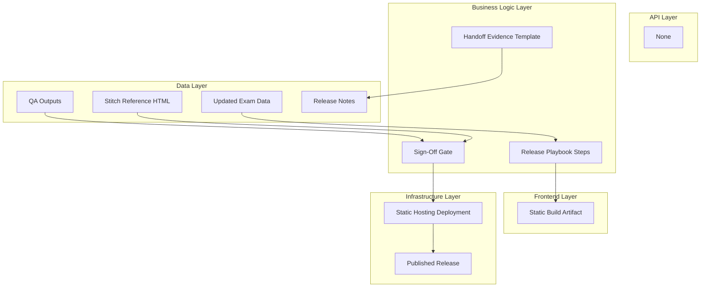

# Goal

Define and institutionalize a concise release execution and handoff process for static cycle deployments, with clear evidence capture and approval gates. All UI parity steps in the playbook must reference stitch/2944944676816621264/668a3253350e441690c92f6971809c95/Exam-Tracker-Deadline-Machine.html.

## Requirements

- Define release execution phases: pre-check, update, verify, approve, publish.
- Define mandatory artifacts for handoff.
- Define criteria for blocking release and rollback fallback.
- Align playbook steps with PRD and QA checklist outputs.

## Technical Considerations

### System Architecture Overview



### Database Schema Design

No database.

### API Design

No API endpoints.

### Frontend Architecture

#### Component Hierarchy Documentation

```text
Release Workflow Docs
├── Playbook
├── Handoff Template
└── Sign-Off Checklist
```

### Security Performance

- Keep release flow short and deterministic.
- Require explicit sign-off checkpoints for risk control.
