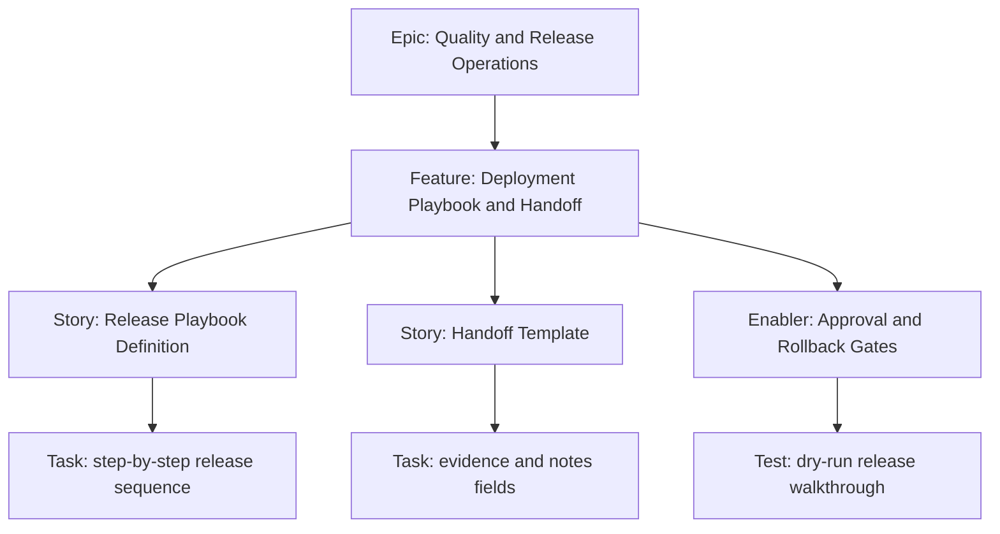

# 1. Project Overview

- Feature Summary: Build a repeatable release playbook and handoff template for static exam-cycle deployments.
- Success Criteria: Complete checklist coverage, approval clarity, and low release error rate.
- Key Milestones:
  - Playbook draft complete
  - Handoff template complete
  - Dry-run release simulation complete
- Risk Assessment:
  - Risk: skipped steps under time pressure
  - Mitigation: explicit gate checklist and sign-off requirement

## 2. Work Item Hierarchy

## 3. GitHub Issues Breakdown

- Story: Release Playbook Definition (3 pts)
- Story: Handoff Template (2 pts)
- Enabler: Approval and Rollback Gates (2 pts)
- Test: dry-run release walkthrough (1 pt)

## 4. Priority and Value Matrix

- Priority: P2
- Value: Medium
- Labels: `priority-medium`, `value-medium`, `quality`

## 5. Estimation Guidelines

- Total estimate: 8 story points
- Feature size: S

## 6. Dependency Management

- Blocked by: QA feature outputs for final sign-off criteria
- Blocks: reliable recurring cycle deployment operations

## 7. Sprint Planning Template

## Sprint Goal

Primary Objective: Establish and validate release/handoff operations for cycle updates.

Stories in Sprint:
- Release Playbook Definition (3)
- Handoff Template (2)
- Approval and Rollback Gates (2)
- Dry-run walkthrough (1)

Total Commitment: 8 points

## 8. GitHub Project Board Configuration

- Move to Done when dry-run is completed and handoff template is approved.
