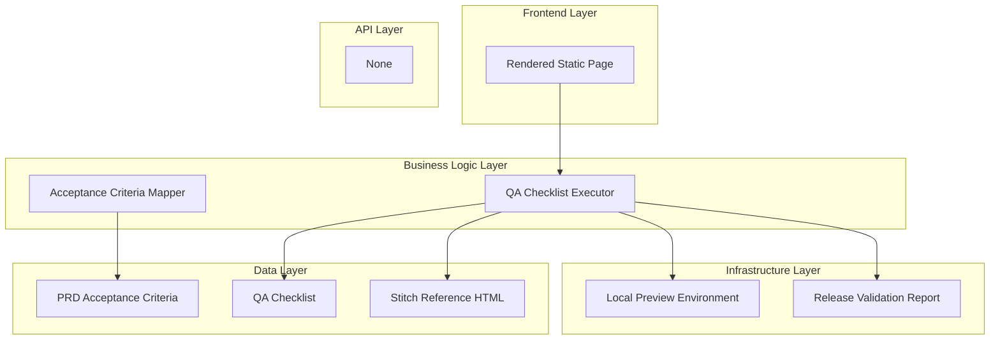

# Goal

Create a repeatable QA workflow for visual parity and responsive correctness that can be executed before every static release. All UI parity checks must compare against stitch/2944944676816621264/668a3253350e441690c92f6971809c95/Exam-Tracker-Deadline-Machine.html.

## Requirements

- Define checklist sections for shell, cards, states, footer, and mobile nav.
- Define viewport test matrix and expected outcomes.
- Define evidence capture format for pass/fail notes.
- Link every check to corresponding PRD acceptance criterion.

## Technical Considerations

### System Architecture Overview



### Database Schema Design

No database required.

### API Design

No API endpoints.

### Frontend Architecture

#### Component Hierarchy Documentation

```text
QA Workflow
├── Visual Parity Checklist
├── Responsive Matrix
└── Evidence Report Template
```

### Security Performance

- Keep QA process lightweight to support frequent cycle runs.
- Use clear pass/fail criteria to reduce ambiguity.
