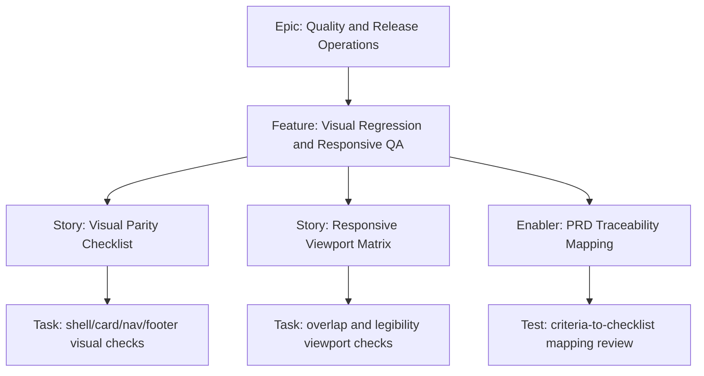

# 1. Project Overview

- Feature Summary: Establish visual and responsive QA workflow for release confidence.
- Success Criteria: Checklist completeness, PRD traceability, reproducible validation results.
- Key Milestones:
  - Checklist draft complete
  - Viewport matrix complete
  - Pilot QA run complete
- Risk Assessment:
  - Risk: subjective parity decisions
  - Mitigation: explicit Stitch reference alignment criteria

## 2. Work Item Hierarchy

## 3. GitHub Issues Breakdown

- Story: Visual Parity Checklist (3 pts)
- Story: Responsive Viewport Matrix (3 pts)
- Enabler: PRD Traceability Mapping (2 pts)
- Test: mapping review (1 pt)

## 4. Priority and Value Matrix

- Priority: P1
- Value: Medium
- Labels: `priority-high`, `value-medium`, `quality`

## 5. Estimation Guidelines

- Total estimate: 9 story points
- Feature size: S

## 6. Dependency Management

- Blocked by: Core feature implementation availability for full-page checks
- Blocks: Final release sign-off

## 7. Sprint Planning Template

## Sprint Goal

Primary Objective: Create and validate a repeatable parity and responsive QA process.

Stories in Sprint:
- Visual Parity Checklist (3)
- Responsive Viewport Matrix (3)
- PRD Traceability Mapping (2)
- Mapping review (1)

Total Commitment: 9 points

## 8. GitHub Project Board Configuration

- Move to Done when pilot run and evidence report are attached.
