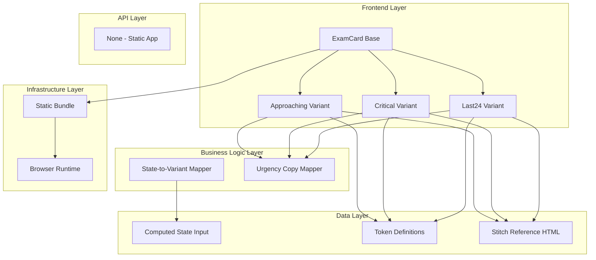

# Goal

Implement the active urgency card family (D-5, D-2, D-1) as reusable state-aware card variants that preserve strict visual hierarchy and pressure escalation. All UI component decisions must be validated against stitch/2944944676816621264/668a3253350e441690c92f6971809c95/Exam-Tracker-Deadline-Machine.html.

## Requirements

- Create variant card primitives for APPROACHING, CRITICAL, and LAST 24 HOURS.
- Implement per-variant badge, microcopy, border/shadow accent, and timer layout.
- Add variant-specific sections (progress rail, review action, segmented urgency block) as required.
- Preserve order and naming conventions from PRD.

## Technical Considerations

### System Architecture Overview



### Database Schema Design

No database required.

### API Design

No API endpoints.

### Frontend Architecture

#### Component Hierarchy Documentation

```text
Exam Cards List
├── Last24Card (D-1)
├── CriticalCard (D-2)
└── ApproachingCard (D-5)
```

### Security Performance

- Keep variant switching class-based and lightweight.
- Avoid expensive layout reflow from unnecessary animations.
