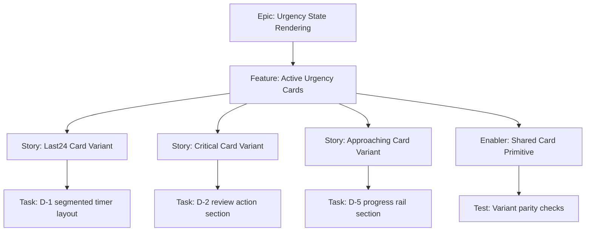

# 1. Project Overview

- Feature Summary: Build D-5, D-2, and D-1 active urgency card variants.
- Success Criteria: Correct badge/copy/accent behavior and documented parity against Stitch source.
- Key Milestones:
  - Variant card primitives complete
  - State-specific sections complete
  - Visual parity QA complete
- Risk Assessment:
  - Risk: state variants drift from reference
  - Mitigation: per-variant parity checklist against Stitch asset

## 2. Work Item Hierarchy

## 3. GitHub Issues Breakdown

- Story: Last24 Card Variant (5 pts)
- Story: Critical Card Variant (5 pts)
- Story: Approaching Card Variant (3 pts)
- Enabler: Shared Card Primitive (3 pts)
- Test: Variant parity checks (2 pts)

## 4. Priority and Value Matrix

- Priority: P1
- Value: High
- Labels: `priority-high`, `value-high`, `frontend`

## 5. Estimation Guidelines

- Total estimate: 18 story points
- Feature size: M

## 6. Dependency Management

- Blocked by: Countdown state output availability
- Blocks: Full card-stack parity completion
- Related: Today and Missed Overrides

## 7. Sprint Planning Template

## Sprint Goal

Primary Objective: Ship all active-state card variants with state-accurate styling.

Stories in Sprint:
- Last24 Card Variant (5)
- Critical Card Variant (5)
- Approaching Card Variant (3)
- Shared Card Primitive (3)
- Variant parity checks (2)

Total Commitment: 18 points

## 8. GitHub Project Board Configuration

- Move to In Review after side-by-side check with Stitch visual source is attached.
