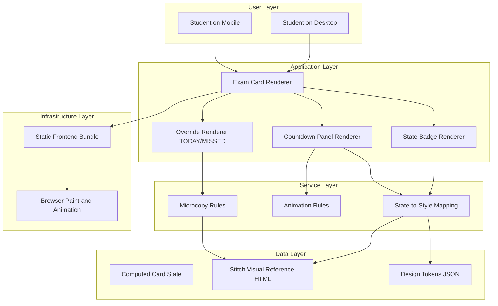

# Epic Architecture Overview

This epic defines the visual state-rendering architecture for urgency-driven exam cards. Any UI component or visual state implementation in this epic must reference stitch/2944944676816621264/668a3253350e441690c92f6971809c95/Exam-Tracker-Deadline-Machine.html as the visual source of truth.

## System Architecture Diagram

## High-Level Features and Technical Enablers

### Features

- Active Urgency Cards (D-5, D-2, D-1)
- Today and Missed Overrides

### Technical Enablers

- Deterministic state-to-visual mapping table.
- Shared card primitives for border, shadow, badge, and timer layouts.
- Animation gating rules for high urgency versus missed states.

## Technology Stack

- Astro component composition.
- Tailwind CSS plus custom token classes.
- Lightweight JS class toggles for state-driven behaviors.

## Technical Value

High. This epic delivers the product’s defining urgency communication layer.

## T-Shirt Size Estimate

L