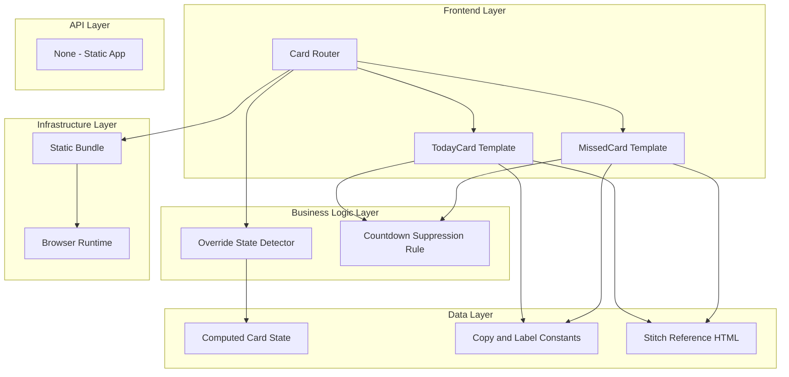

# Goal

Deliver robust TODAY and MISSED override rendering paths that intentionally diverge from active countdown card behavior while preserving visual language consistency. All UI output must be cross-checked against stitch/2944944676816621264/668a3253350e441690c92f6971809c95/Exam-Tracker-Deadline-Machine.html.

## Requirements

- Build TODAY override card template and content slots.
- Build MISSED override card template with muted static treatment.
- Gate countdown rendering off for both override states as required.
- Ensure override templates compose cleanly within main card stack.

## Technical Considerations

### System Architecture Overview



### Database Schema Design

No database changes.

### API Design

No APIs required.

### Frontend Architecture

#### Component Hierarchy Documentation

```text
Exam Cards List
├── TodayCard Override
└── MissedCard Override
```

### Security Performance

- Disable unnecessary timer updates for MISSED state to avoid wasted work.
- Keep override routing branch simple and deterministic.
