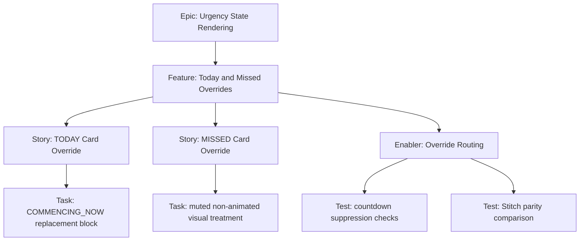

# 1. Project Overview

- Feature Summary: Implement TODAY and MISSED override card behavior.
- Success Criteria: Countdown suppression behavior is correct and state visuals match reference.
- Key Milestones:
  - Override routing complete
  - TODAY template complete
  - MISSED template complete
  - QA parity validation complete
- Risk Assessment:
  - Risk: override states still render active countdown fragments
  - Mitigation: explicit suppression tests in checklist

## 2. Work Item Hierarchy

## 3. GitHub Issues Breakdown

- Story: TODAY Card Override (5 pts)
- Story: MISSED Card Override (3 pts)
- Enabler: Override Routing (2 pts)
- Test: Suppression and parity checks (2 pts)

## 4. Priority and Value Matrix

- Priority: P1
- Value: High
- Labels: `priority-high`, `value-high`, `frontend`

## 5. Estimation Guidelines

- Total estimate: 12 story points
- Feature size: M

## 6. Dependency Management

- Blocked by: State output availability for today/missed
- Related: Active Urgency Cards
- Parallel: Can proceed with placeholder state input for template work

## 7. Sprint Planning Template

## Sprint Goal

Primary Objective: Deliver today/missed visual overrides with suppression correctness.

Stories in Sprint:
- TODAY Card Override (5)
- MISSED Card Override (3)
- Override Routing (2)
- Suppression and parity checks (2)

Total Commitment: 12 points

## 8. GitHub Project Board Configuration

- Move to Testing only after screenshot evidence against Stitch reference is attached.
